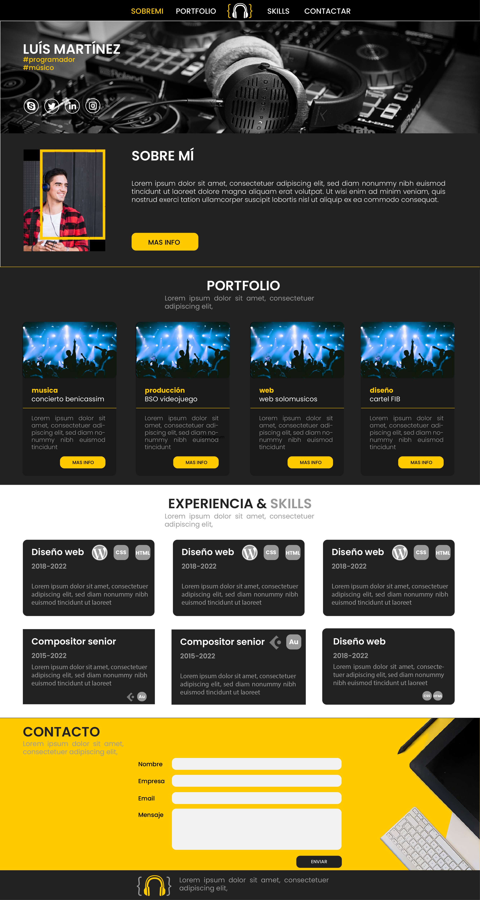

# Taller: Desarrollo de Páginas Web

**Duración:** 40 horas (20 sesiones)

**Objetivo General:** El estudiantado aplicará los conocimientos básicos en lenguaje HTML y lenguaje CSS con la finalidad de realizar el desarrollo de su primera página web estática.

**Temario**

1. [Introducción](./introducción.md)
2. [Herramientas para la creación de páginas web](./herramientasPaginasWeb.md)
3. [Estructura básica de un documento HTML](./estructuraBasica.md)
4. [Lenguaje HTML](./lenguajeHTML.md)
5. [Lenguaje CSS](./lenguajeCSS.md) 
6. Proyecto final

[**Link a moodle**](https://educacion.pilares.cdmx.gob.mx/)

[portafolio](https://github.com/angelumoca21/Portafolio)
