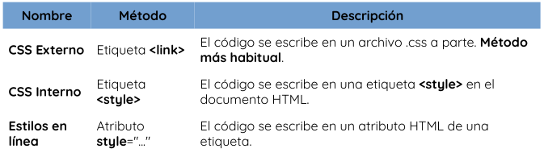
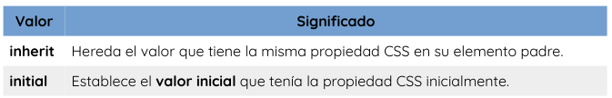
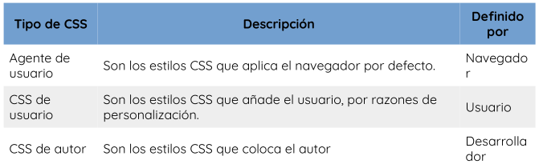
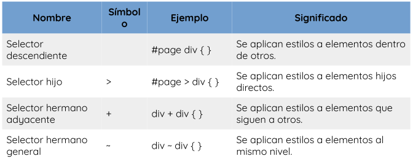

# Lenguaje CSS

Las hojas de estilo en cascada, tal es su traducción del inglés **Cascading Style Sheets (CSS)**, tienen como función establecer reglas de representación de un documento. Mediante estas reglas podremos establecer medidas, colores o cualquier otra característica de representación de una página web. La función principal de CSS es, por lo tanto, la de permitir separar el contenido y la estructura que se define en un documento HTML, de la representación, que queda a cargo de las hojas de estilos.
Tres de los principales beneficios para el uso de CSS son:
- Resuelve un gran problema. Antes de CSS, las etiquetas como fuente, color, estilo de fondo, alineación de elementos, borde y tamaño tenían que repetirse en cada página web. Este era un proceso muy largo. 
- Ahorra mucho tiempo. Las definiciones de estilo CSS se guardan en archivos CSS externos, por lo que es posible cambiar todo el sitio web cambiando solo un archivo.
- Proporcionar más atributos. CSS proporciona atributos más detallados que usar simplemente HTML para definir la apariencia del sitio web.


Antes de comenzar a trabajar con CSS hay que conocer las diferentes formas para incluir estilos en nuestros documentos HTML, ya que hay varias, cada una con sus particularidades y diferencias.
En principio, tenemos tres formas diferentes de hacerlo, siendo la primera la más común y la última la menos habitual:



- **Enlace a CSS externo (link):** en la cabecera de nuestro documento HTML, podemos incluir una etiqueta `<link>` con la que establecemos una relación entre el documento actual y el archivo CSS que indicamos en el atributo `href`:
```
<!DOCTYPE html>
<html lang="es">
<head>
    <link rel="stylesheet" href="./css/style.css">
</head>
</html>
```

- **Incluir CSS en el HTML (style):** para incluir estilos CSS en nuestra página es la de añadirlos directamente en el documento HTML, a través de una etiqueta `<style>` que contendrá el código CSS:
```
<!DOCTYPE html>
<html>
    <head>
        <title>Título de la página</title>
        <style>
            div {
            background: hotpink;
            color: white;
            }
        </style>
    </head>
    <body>
        <div>
            <p>Hola Mundo</p>
        </div>
    </body>
</html>
```

- **Estilos en línea (atributo style):** a través del atributo style de la propia etiqueta donde queramos aplicar el estilo, colocando ahí las propiedades CSS:
```
<!DOCTYPE html>
<html lang="es">
<head>
    <meta charset="UTF-8">
    <meta name="viewport" content="width=device-width, initial-scale=1.0">
    <title>Lenguaje CSS</title>
</head>
<body>
    <div style="background-color: red;">2do Hola Mundo</div>
</body>
</html>
```

## Sintaxis básica

La estructura CSS se basa en reglas que tienen el siguiente formato: Debemos escribir el selector, abrir llaves, indicar la propiedad y posteriormente asignarle el valor correspondiente. Cerramos la línea con punto y coma, y seguimos agregando pares de propiedad/valor hasta que completemos la declaración (cada una debe estar finalizada con punto y coma). Cuando terminamos, cerramos la llave. La declaración sería entonces:
```
selector {
    propiedad:valor;
}
```

- **Selector:** es el elemento HTML que vamos a seleccionar del documento para aplicarle un estilo concreto, este podría ser el nombre un elemento, su clase o su identificador. 
- **Propiedad:** es una de las diferentes características que brinda el lenguaje CSS y que aplicaremos al selector para darle estilo.
- **Valor:** cada propiedad CSS tiene una serie de valores concretos a que se le pueden asignar, con los que tendrá uno u otro comportamiento.

### Clases

El uso de clases en CSS permite abstraerse del elemento en particular y construir reglas que se apliquen a toda aquella etiqueta HTML que cuente con el atributo `class` correspondiente. Aquí es importante resaltar que las clases pueden aplicarse a diversos elementos. Cuando construimos reglas para clases, debemos incluir el `.` (punto) antes del nombre. Ejemplo:
```.nombre_clase {propiedad:valor;}```

### ID'S 

Si creamos reglas para una determinada `id`, debemos anteponerle el símbolo #. Ejemplo:
```#nombre_id {propiedad:valor;}```

## Herencia en CSS

Algunas propiedades CSS se heredan desde los elementos padres a los elementos hijos, modificando el valor que tienen por defecto.
Además de los valores habituales de cada propiedad CSS, también podemos aplicar ciertos valores especiales que son comunes a todas las propiedades existentes. Con estos valores modificamos el comportamiento de la herencia en dicha propiedad:



## Cascada en CSS

Uno de los conceptos principales más importantes de CSS es el concepto denominado cascada. De hecho, la cascada es la que le da sentido a la C inicial en el nombre de CSS. Supongamos que aplicamos unos estilos CSS a exactamente el mismo se selector (div) y donde coincide la propiedad CSS color con diferente valor en cada bloque:
```
<div>Texto del elemento</div>
<style>
    div {
    color: red;
    padding: 8px
    }
    div {
    color: blue;
    background-color: grey
    }
</style>
```

En este caso, ¿cuál de las dos reglas prevalece, si tenemos en cuenta que se refieren al mismo elemento y están al mismo nivel? La respuesta es muy fácil: Prevalece siempre la última regla definida, la cuál mezcla y sobre escribe las propiedades anteriores.

Sin embargo, puede ocurrir que en determinados casos no esté tan claro cuál es el estilo que debería sobre escribir a los anteriores. Ahí es cuando entra en juego el concepto de cascada en CSS, que es el que se encarga de eliminar la ambigüedad y determinar el que tiene prioridad. Supongamos el siguiente caso, donde tenemos un elemento `<div>` con un id y una clase:
```
<div id="nombre" class="clase">Texto del elemento</div>
<style>
    div{
        color: red;
    }
    #nombre{
        color: blue;
    }
    .clase{
        color: green;
    }
</style>
```

El navegador, para saber que bloque de estilos tiene prioridad sobre los demás, analiza (por orden) tres conceptos clave del código CSS: su **importancia**, su **especificidad** y su
**orden**. 

- La **importancia** de un código CSS se determina dependiendo de las hojas de estilo donde está colocado. Generalmente, no necesitaremos preocuparnos de este factor, pero siempre es una buena idea conocer como funciona. Existen varios tipos de hojas de estilo, de menor a mayor importancia:



Aunque no es recomendable utilizarlo frecuentemente (puede convertirse en una mala práctica), se puede añadir al final de cada regla el texto `!important`, consiguiendo que la regla en cuestión tenga prioridad sobre las demás, independientemente del nivel o la altura a la que estén.

Si la importancia no elimina la ambigüedad, se pasa a determinar la:
- **Especificidad** de los selectores CSS, que es uno de los criterios más importantes de la cascada de CSS. Para determinar la especificidad de un selector, se sigue un cálculo matemático que podríamos pensarlo como en un sistema en el cual se suman y comparan los puntos acumulados: los *elementos valen 1 punto; las clases 10 puntos; los identificadores 100 puntos y la declaración de estilo inline 1000 puntos.*
    - Ganará la regla más específica.
    - Si resulta que dos o más reglas tienen el mismo puntaje, triunfará la que se encuentre más abajo en la cascada.
    - En todos los casos, una declaración inline será la más específica, salvo que otra tenga `!important`.
Ejemplo:
```
<button class=hi> Hola </button>
<style>
    .hi{
        background-color: green;
    }
    button{
        background-color: red;
    }
</style>
```

En este ejemplo hay dos reglas que afectan al mismo elemento. Aunque la regla de elemento botón está al final de la cascada, la regla de clase es más especifica y por tanto es la que se aplicara.

En CSS, es posible crear múltiples reglas CSS para definir un mismo concepto. En este caso, la que prevalece ante todas las demás depende de ciertos factores, como es la «altura» a la que está colocada la regla y que da un **orden**:
- El *CSS en linea* en un elemento HTML es el que tiene mayor precedencia.
- En segundo lugar, el *CSS interno.* 
- Por último, los documentos *CSS externos* son la tercera opción de prioridad a la hora de tomar en cuenta las reglas CSS. 

## Selectores en CSS

Los selectores de CSS se utilizan para seleccionar el contenido que se desea diseñar. Los selectores son parte del conjunto de reglas CSS. Hay varios tipos diferentes de selectores en CSS.
- **Selector de elementos CSS:** El selector de elementos selecciona el elemento HTML por su nombre.
```
div {
    background-color: red;
}
```

- **Selector de ID de CSS:** selecciona el atributo id de un elemento HTML para seleccionar un elemento específico. Un id siempre es único dentro de la página, por lo que se elige para seleccionar un único elemento. Se escribe con el carácter hash (#), seguido del id del elemento.
```
#idElemento {
    text-align: center;
    color: red;
}
```

- **Selector de clase CSS:** selecciona elementos HTML con un atributo de class específico. Se utiliza con un carácter de punto . seguido del nombre de la clase. La diferencia principal respecto a los IDs es que las clases no se requiere que sean únicas, sino que pueden repetirse a lo largo del documento HTML.
```
<h1 class="center">Este encabezado es azul y está alineado al centro.</h1>
<p class="center">Este párrafo es azul y está alineado al centro.</p>
<style>
    .center{
        text-align: center;
        color: blue;
    }
</style>
```

- **Selector de grupo CSS:** se utiliza para seleccionar todos los elementos con las mismas definiciones de estilo. El selector de agrupación se utiliza para reducir el código. Las comas se utilizan para separar cada selector en la agrupación.
```
<h1>Hola</h1>
<h2>Bienvenidos</h2>
<p>Este es un párrafo</p>
<style>
    h1,h2,p {
        text-align: center;
        color: blue;
    }
</style>
```

- **Selector universal CSS:** (*) se utiliza como carácter comodín. Selecciona todos los elementos de las páginas.
```
*{
    margin: 0;
    padding: 0;
}
```

### Otros tipos de selectores

